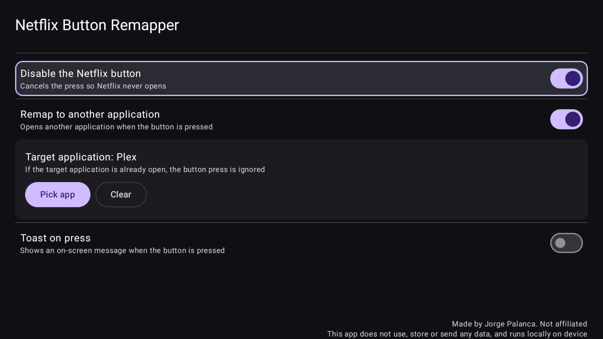

# Android TV Netflix Button Remapper (no root)



Remap (or block) the Netflix button on Nvidia Shield, Google TV Streamer
and Chromecast with Google TV remotes.
Kotlin + Jetpack Compose, Gradle Kotlin DSL, minSdk 23.

## Supported devices

Tested on **NVIDIA Shield TV Pro** and confirmed working on
**Google TV Streamer (4K)** (user-tested). **Chromecast with Google TV
(4K)** shares the Streamer Voice Remote family, whose Netflix key reports
`KEYCODE_BUTTON_3` (`190`), covered by the matcher. Full signature set:
keyCode `181`, `190`, `191` or `199`, or scanCode `440`. To check any
other remote, run `adb shell getevent -l`, press the Netflix button, and
compare the reported codes. Other Shield models (2015 / 2017 / 2019 /
tube) carry the same expectation. If yours differ, file an issue with
the dump.

## Important: foreground service alone cannot intercept the button

On stock Android only the focused app receives key events. A plain
`Service` never sees global KEYCODE 181, so this project uses the
supported no-root path:

- `NetflixButtonAccessibilityService` (flagRequestFilterKeyEvents) — consumes the Netflix key system-wide (181/190/191/199/scan 440)
- `BlockerForegroundService` — persistent status notification, keeps process alive
- `MainActivity.onKeyDown` — fallback while the settings UI has focus
- `BootReceiver` — restart status service after reboot
- `ButtonHandler` — block / remap / toast logic backed by DataStore

Enable once on the device:
Shield: Settings → Device Preferences → Accessibility → Netflix Button Remapper → Enable.
Google TV: Settings → System → Accessibility → Netflix Button Remapper → Enable.

## Versions (verified, Sep 2026)

- AGP 9.4.1, Gradle 9.7.1, JDK 17
- Kotlin 2.4.20
- Compose BOM 2026.09.00
- compileSdk 37, targetSdk 35, minSdk 23

## Structure

```
settings.gradle.kts
build.gradle.kts
gradle/libs.versions.toml
app/build.gradle.kts
app/src/main/AndroidManifest.xml
app/src/main/res/xml/accessibility_service_config.xml
app/src/main/java/com/example/netflixbuttonblocker/
  MainActivity.kt
  SettingsScreen.kt
  NetflixButtonAccessibilityService.kt
  BlockerForegroundService.kt
  ButtonHandler.kt
  Prefs.kt (DataStore) + CachedSettings.kt (synchronous cache)
  BootReceiver.kt
  Constants.kt
app/src/test/.../NetflixButtonMatcherTest.kt
app/src/main/res/values-*/strings.xml (32 locales, incl. disclosure, guard, toast + footer copy)
app/src/main/res/{mipmap-*,drawable,drawable-xhdpi} (vector + bitmap icons, TV banner)
store/ (Play icon 512 + feature graphic 1024x500)
.github/workflows/build-apk.yml (CI: unit tests, debug APK, release AAB)
```

## Build

```powershell
gradle :app:testDebugUnitTest :app:assembleDebug --no-daemon
# APK: app\build\outputs\apk\debug\app-debug.apk
```

## Install on the device

### Option A — adb (cable or network)

```powershell
adb install -r app\build\outputs\apk\debug\app-debug.apk
```

### Option B — LocalSend (no cable, no adb)

1. Install **LocalSend** on your PC
   ([localsend.org](https://localsend.org)) and on the Shield
   (Google Play on the TV, or sideload the Android TV APK from GitHub).
2. On the device, enable installs from unknown sources when prompted:
   Settings → Apps → Security & Restrictions → Unknown Sources.
3. Connect both devices to the **same Wi-Fi / LAN**.
4. In LocalSend on the PC: select the device → send
   `app\build\outputs\apk\debug\app-debug.apk`
   (or the `app-debug` artifact downloaded from GitHub Actions).
5. On the device, open the received file with a file manager
   (e.g. X-plore / File Commander) and tap Install.

Then open the app on the device: enable Accessibility access first
(the toggles stay off until then), pick a target app (optional), and
toggle Block / Remap / Toast.
